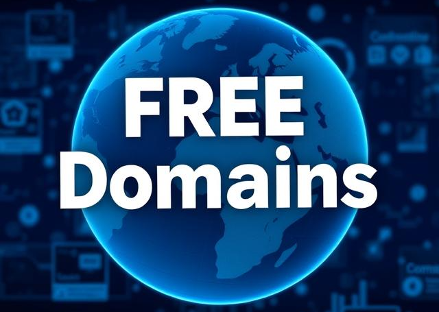

<!-- data:start -->

 
<h3>🌐 Free Domains</h3>

A curated collection of free subdomains ideal for personal websites, open-source projects, portfolio showcases, and innovative online ventures.

&bull;

⭐ [Star on GitHub](https://github.com/harys722/free-domains)
&bull;
🤝 [Contribute](https://github.com/harys722/free-domains/blob/main/CONTRIBUTING.md)
&bull;
🌐 <a href="https://free-domains.harys.is-a.dev/" target="_blank" rel="Website noreferrer">Website</a>

 

 
 

<!-- START LIST -->
 | Domain | About | Repository | Availability | 
 |--------|-------|------------|----------------|
 | [is-a.dev](https://www.is-a.dev/) | Grab your own sweet-looking '.is-a.dev' subdomain. | [is-a-dev/register](https://github.com/is-a-dev/register)      | ✅ |
 | [js.org](https://js.org/) | Dedicated to JavaScript and its awesome community since 2015 | [js-org/js.org](https://github.com/js-org/js.org)      | ✅ |
 | [Open Domains](https://open-domains.net) | Free subdomains for personal sites, open-source projects, and more. It offers `is-cool.dev` & `is-a-fullstack.dev` & `is-local.org` & `is-not-a.dev` & `localplayer.dev`. | [open-domains/register](https://github.com/open-domains/register)      | ✅ |
 | [Domains Project](https://getyourfree.space/) | Free developer subdomains under owns.it.com, with more domains coming soon. | [domainsproject/register](https://github.com/domainsproject/register)      | ✅ |
 | [DigitalPlat FreeDomain](https://domain.digitalplat.org/) | DigitalPlat FreeDomain: Free Domain For Everyone. We offers `.DPDNS.ORG`, `.US.KG`, `.QZZ.IO` and `.XX.KG` domain extensions.	| [DigitalPlatDev/FreeDomain](https://github.com/DigitalPlatDev/FreeDomain)      | ✅ |
 | [Open Host](https://registry.openhost.uk/) | A free subdomain service offering subdomains on `prvcy.page`, `16-b.it`, `32-b.it`, `64-b.it`, `pride.moe` and `pride.ngo`. | — | ✅ |
 | [foo.ng](https://foo.ng/) | Free `foo.ng` subdomains for everyone. | [Pokymon/foo.ng](https://github.com/Pokymon/foo.ng)      | ✅ |
 | [Is-Cool-Me](https://registry.openhost.uk/) | Free subdomains for personal sites, open-source projects, and more, offering subdomains on `is-epic.me` and  `is-awsm.tech`. | — | ✅ |
 | [is-a-good.dev](https://is-a-good.dev/) | Register for your is-a-good.dev domain! | [is-a-good-dev/register](https://github.com/is-a-good-dev/register)      | ✅ |
 | [is-truly-a.pro](https://is-truly-a.pro/) | Free `is-truly-a.pro` subdomains, available for everyone! | [is-truly-a-pro/register](https://github.com/is-truly-a-pro/register)      | ✅ |
 | [is-not.cool](https://is-not.cool/) | Get your own 'is-not.cool' subdomain! | [is-not-cool/registration](https://github.com/is-not-cool/registration)      | ✅ |
 | [thedev.id](https://thedev.id/) | An identity for developers on the web. | [thedev-id/thedev.id](https://github.com/thedev-id/thedev.id)     | ✅ |
 | [thedev.me](https://thedev.me/) | Get your free '{name}.thedev.me' domain. | [thedev-me/register](https://github.com/thedev-me/register)     | ✅ |
 | [cluster.ws](https://cluster.ws/) & [wip.la](https://wip.la/) | Get a cluster.ws & wip.la domain for free and instantly | [Olivr/free-domain](https://github.com/Olivr/free-domain)      | ✅ |
 | [js.cool](https://js.cool/)| Provide free subdomains for Chinese open source projects (since August 2020), now support Vercel! | [willin/domain](https://github.com/willin/domain)      | ✅ | 
 | [ngo.us](https://nic.ngo.us/) | Free subdomains exclusively for nonprofits, nongovernmental organizations (NGOs) and initiatives. | [ngo-us/registry](https://github.com/ngo-us/registry)      | ✅ |
 | [pp.ua](https://pp.ua/) | Free pp.ua subdomains. | — | ✅ |
 | [part-of.my.id/](https://part-of.my.id/) | your own personal id (`part-of.my.id`) for your website. | [partofmyid/register](https://github.com/partofmyid/register)      | ✅ |
 | [zone.id](https://zone.id/) | Zone.ID is a premium subdomain provider as an alternative to the traditional .id TLD. | — | ✅ |
 | [nyc.mn](https://dot.nyc.mn/) | Stand out in the digital world with a .NYC.mn domain, crafted to showcase your unique connection to New York City. Whether you’re a local New Yorker or a business in the city that never sleeps, this domain makes your online presence unmistakably tied to one of the most iconic cities on the planet. | — | ❌ |
 | [is-an.app](https://is-an.app/) |  🌐 DNS configuration for some of my domains. (Not available anymore) | [tarampampam/free-domains](https://github.com/tarampampam/free-domains)      | ❌  |
 | [is-a.co](https://is-a.co/) | 🌐 Grab your own subdomain for free Follow the steps listed below to get your own subdomain! | [PythonicBoat/is-a.co](https://github.com/PythonicBoat/is-a.co)      | ❌ |
 | [withcoding.me](http://withcoding.me/) | Free subdomain for everyone. | [JastinXyz/withcoding.me](https://github.com/JastinXyz/withcoding.me)      | ❌ |
 | [is-amaz.ing](https://is-amaz.ing) | Register your is-amaz.ing project domain here! | [is-amazing/register](https://github.com/is-amazing/register)      | ❌ |
 | [tilde.tk](https://tilde.tk/) | In need of a cool subdomain? And want it to be your own UNIX home directory? Then tilde.tk (~.tk) is right for you | [youngchief-btw/tilde.tk](https://github.com/youngchief-btw/tilde.tk)      | ❌ |
 | [merahputih.moe](https://Merahputih.moe/) | Are you weeb developer looking for free webspace to host your project? Get free subdomain merahputih.moe UwU | [ScathachGrip/merahputih.moe](https://github.com/ScathachGrip/merahputih.moe)      | ❌ |

 <!-- END LIST -->

## License
This project is licensed under the [MIT License](LICENSE).
 
 
⬆️ [**Back to Top**](#-free-domains)
